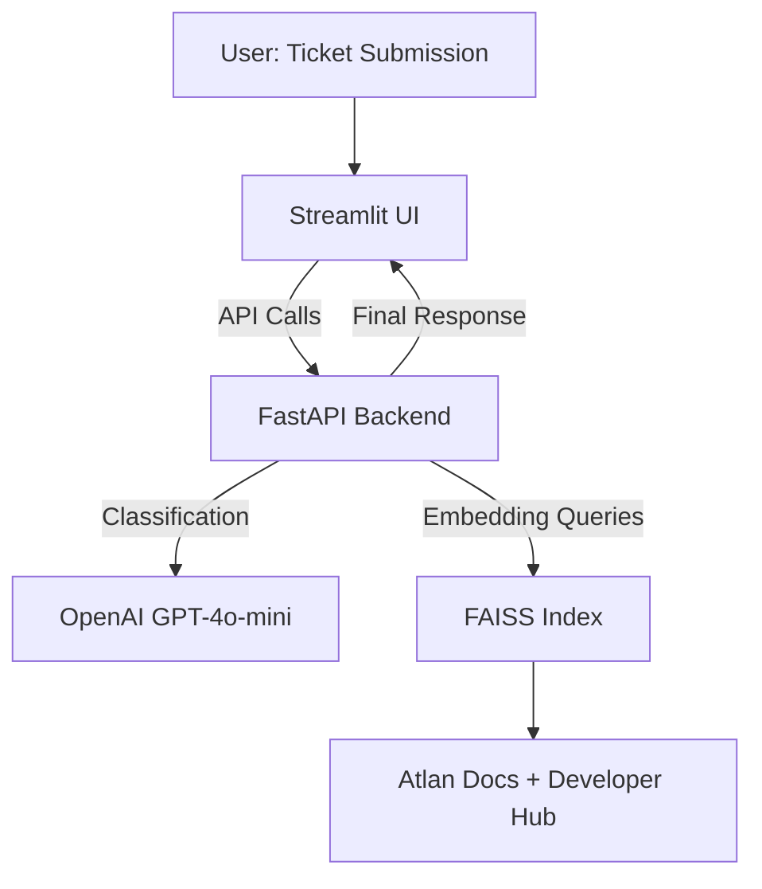

# Atlan_customercopilot

# Atlan Support Copilot — Demo 🚀

##  Context

At Atlan, our customer support team is the backbone of our customer relationships. They handle a wide range of support tickets daily — from simple *how-to* questions to complex technical bug reports. As Atlan scales, efficiently managing these tickets is crucial to ensuring customers get timely and accurate help.

The **Atlan Support Copilot** is an AI-powered assistant that automates ticket triage and drafts intelligent responses using classification + retrieval augmented generation (RAG).

---

##  Problem Statement

The goal was to build the **core AI pipeline** that can:

* Ingest tickets.
* Classify them by **topic, sentiment, priority**.
* Respond with either:

  * A direct **RAG-based answer** (for docs-related queries).
  * Or a **routing message** (if not in RAG scope).

The AI pipeline is showcased through a functional **dummy helpdesk** web app (FastAPI backend + Streamlit frontend).

---

##  Core Features

### 1. Bulk Ticket Classification Dashboard

* Loads sample tickets from `sample_tickets.json`.
* Each ticket is classified with:

  * **Topic Tags**: How-to, Product, Connector, Lineage, API/SDK, SSO, Glossary, Best practices, Sensitive data.
  * **Sentiment**: Frustrated, Curious, Angry, Neutral.
  * **Priority**: P0 (High), P1 (Medium), P2 (Low).
  * **Confidence + Explanation.**
* Displays analytics (tickets by topic and priority).

### 2. Interactive AI Agent

* UI accepts a new ticket (title, body, channel).
* Shows **internal analysis** (AI classification).
* Shows **final response**:

  * If topic ∈ {How-to, Product, Best practices, API/SDK, SSO} → runs **RAG** against Atlan Docs & Developer Hub.
  * Else → routes to relevant team.
* All RAG answers cite **sources (URLs)**.

### 3. Knowledge Base (RAG)

* Crawls & indexes docs from:

  * [https://docs.atlan.com/](https://docs.atlan.com/)
  * [https://developer.atlan.com/](https://developer.atlan.com/)
* Embeds chunks with `text-embedding-3-small`.
* Indexed using FAISS for retrieval.

---

## 🛠️ Tech Stack

* **Backend**: FastAPI (classification, RAG, analytics API)
* **Frontend**: Streamlit (UI dashboard + interactive agent)
* **LLM**: OpenAI GPT-4o-mini for classification + RAG answering
* **Embeddings**: OpenAI `text-embedding-3-small`
* **Vector DB**: FAISS
* **Scraping**: Requests + BeautifulSoup
* **Infra**: Local demo; deployable to Railway / Render / Streamlit Cloud

---

## 🏗️ Architecture



📌 A PNG diagram version is included in the repo as **`architecture.png`**.

---

## 🚀 Setup Instructions

### 1. Clone Repo

```bash
git clone https://github.com/Madhulika-s/atlan-support-copilot.git
cd atlan-support-copilot
```

### 2. Create Virtual Env & Install Deps

```bash
python -m venv .venv
source .venv/bin/activate
pip install --upgrade pip
pip install -r requirements.txt
```

### 3. Add API Key

Create a `.env` file in the repo root:

```bash
OPENAI_API_KEY=sk-xxxxxx
```

### 4. Run Backend

```bash
uvicorn services.api.app:app --host 0.0.0.0 --port 8000 --reload
```

### 5. Run Frontend

```bash
streamlit run services/ui/app.py --server.port=8501
```

Now open 👉 [http://localhost:8501](http://localhost:8501)

---

##  Deliverables

* ✅ Working Helpdesk app (classification + RAG)
* ✅ GitHub Repo with code
* ✅ README.md (this file)
* ✅ Architecture diagram

---

##  Evaluation

* **Implementation**: Both bulk classification & interactive agent fully working.
* **Problem-solving**: Logical pipeline with RAG + heuristic fallback.
* **Accuracy**: RAG answers cite sources; routing works for other topics.
* **Maintainability**: Modular FastAPI backend + Streamlit frontend.
* **Communication**: Clear docs & diagram.

---

## Future Enhancements

* Add feedback loop (was answer helpful?).
* Support multiple languages.
* Multi-channel integrations (Slack, WhatsApp).
* Fine-tuned ticket classifier.

- for the **Atlan AI Copilot Challenge**
